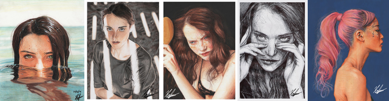

# Hernán Andrés Ianigro

Hola, me llamo **Hernán** y este es mi cuarto cuatrimestre en la carrera de **Tecnicatura en Programación**.
Tengo 34 años, a pocos días de cumplir 35.
En los años 2021 y 2022 terminé los años 2º y 3º del polimodal que me habían quedado sin cursar luego de abandonar los estudios secundarios debido a problemas de salud, y al año siguiente comencé esta carrera en la universidad.

Debido a mis problemas tuve diferentes trabajos formales cortos y muchos de forma independiente. Casi no salía de mi hogar hasta que tomé la decisión de seguir un tratamiento, ahí fue cuando también decidí terminar mis estudios.

Me inscribí en la carrera de programación en 2023 ya que un amigo quería inscribirse y me inspiró a hacerlo tambien. En este momento no cursamos más juntos debido a que cada uno tuvo diferentes notas y avances en la carrera (al menos por el momento). 

Espero que esta carrera me ayude a conseguir un trabajo al que me pueda adaptar facilmente y algún día quizas poder trabajar en el extranjero.

Siempre me gustó la computación en términos generales, pero nunca me metí mucho en la programación y lo más técnico del asunto. Aún no llegué a encontrar la pasión en esta carrera, pero todavía me falta mucho por ver y aprender.

Por muchos años fui dibujante, especialmente de retratos. Esta imagen es un autorretrato que hice hace un par de años, y la suelo usar como imagen de perfil bastante seguido.

## Mis hobbies

- :crayon: Como dibujante, empecé a los 14 años durante mi 6º grado de primaria. Mi motivación principal fue el animé, el cual miraba desde los 5 años. Fue lo primero que probé dibujar y a medida que iba ganando práctica me fui moviendo al realismo. Hice dibujos, caricaturas, retratos, murales y animaciones. Estos son algunos de mis dibujos:

- :memo: A los 18 años comencé a escribir, lo que me inspiró a hacerlo fue el **día de la nevada en Argentina** (9 de Julio del 2007). Terminé escribiendo 7 libros.

- :alembic: Me encanta la ciencia en general, ya sea física, química, biología o astronomía.

- :camera_flash: Ultimamente estuve explorando fotografía y también quiero probar música (ya que tengo algunos instrumentos, incluyendo un violín).

- :house_with_garden: Mi objetivo principal es superar mis problemas, poder mudarme solo, ayudar a mis padres y cuando sea posible formar mi propia familia y hogar.

### ¡Saludos!
